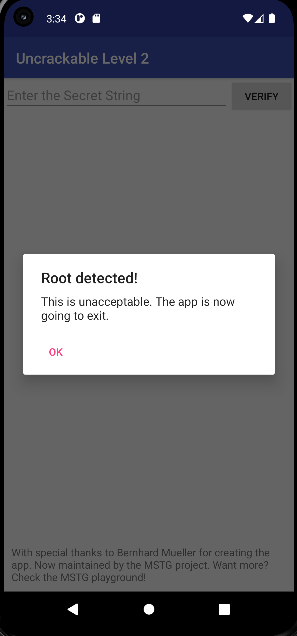

# LAB : Bypass de la Détection de Root Android avec Medusa 

**Auteur :** Ali Benrioui

## Objectif du Lab

Ce laboratoire s'inscrit dans le cadre de l'analyse dynamique des applications mobiles (référentiel OWASP MASTG). L'objectif est d'étudier et de contourner les mécanismes de détection de root implémentés dans l'application cible (Uncrackable Level 2). Le travail repose sur l'utilisation du framework Medusa, une surcouche modulaire et extensible construite sur Frida, permettant d'automatiser les techniques d'instrumentation dynamique appliquées aux applications Android.


---

## Environnement de Test

| Élément | Valeur |
|---|---|
| Cible | `owasp.mstg.uncrackable2` |
| Poste de travail | Windows (PowerShell) |
| Frida | 17.9.1 |
| Medusa | Version dev — 124 modules disponibles |
| Device | Local Socket (Android via ADB) |

---

## Méthodologie et Étapes de Réalisation

### 1. Préparation de l'environnement — Lancement de Medusa

La première phase a consisté à lancer Medusa et à identifier les options disponibles via la commande `--help`.

```bash
python medusa.py --help
```


Medusa charge 124 modules au démarrage. Les options principales utilisées dans ce lab sont :

| Option | Description |
|---|---|
| `-f` (dans `run`) | Spawner et attacher à l'application cible |
| `-d, --device` | Sélectionner le device à utiliser |
| `-s, --save` | Sauvegarder le log de la session |

Medusa est ensuite lancé sans argument pour entrer en mode interactif. Il liste les appareils disponibles et invite à sélectionner le device cible.


---

### 2. Analyse du comportement par défaut

Lors du lancement initial de l'application sans instrumentation, une vérification d'intégrité de l'environnement est effectuée. L'application détecte la présence du root et affiche une boîte de dialogue d'alerte. Toute interaction avec cette alerte entraîne la fermeture immédiate du processus.




---

### 3. Recherche et chargement du module de bypass

Depuis la console Medusa, une recherche des modules disponibles pour la détection de root est effectuée :

```
(socket) medusa➤ search root
```


---

### 4. Injection du script et lancement de la session

L'option `-f` est utilisée pour spawner l'application directement depuis Medusa. Frida s'injecte avant que l'application n'initialise ses contrôles de sécurité, ce qui est déterminant pour neutraliser les vérifications effectuées au démarrage.


---

### 5. Validation du Bypass

Grâce à l'instrumentation, l'application démarre de manière stable. L'alerte de sécurité est interceptée en arrière-plan, laissant l'interface utilisateur pleinement accessible.


> L'application **Uncrackable Level 2** s'ouvre normalement et le champ de saisie est accessible. Le bypass est validé.

---


### Détail des vérifications bypassées

| Vérification | Résultat |
|---|---|
| Détection du binaire `su` | Bypassée |
| Vérification `test-keys` | Bypassée |
| Détection de `Superuser.apk` | Bypassée |
| Hook `isDebuggerConnected()` | Actif en continu |
| Application démarrée sans crash | Confirmée (PID assigné) |

---

## Synthèse

Ce laboratoire démontre l'efficacité d'une approche d'instrumentation modulaire pour le contournement des mécanismes de protection d'applications Android. Medusa, en tant que surcouche à Frida, simplifie le processus en proposant des modules prêts à l'emploi couvrant les cas de détection les plus fréquents (binaires root, vérification des clés de signature, anti-debug). Le spawn de l'application via `-f` est essentiel : il garantit que l'injection est effective avant l'exécution du code de protection, évitant ainsi les conditions de course qui rendraient le bypass inefficace.

---